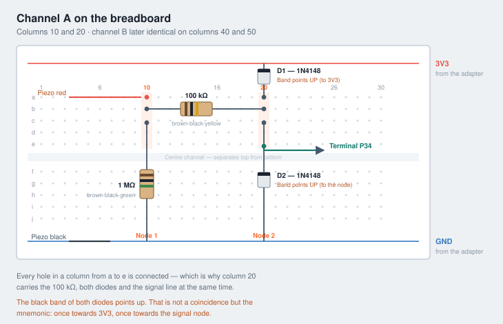
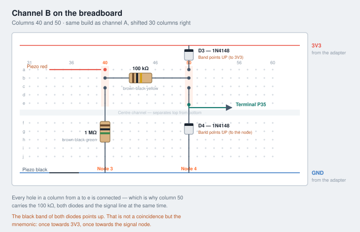

# Zählwerk — Stage 1 and 2, step by step

Everything you have to do from here. Written for someone putting parts on a
breadboard for the first time.

**Stage 1** answers: does the piezo hear the ball, and can it be told apart from
bat clatter? One evening.
**Stage 2** answers: does the logic count a real game right enough? One week.

The reference machine is an **M1 Mac**; **Ubuntu** is documented alongside it.
Pick one and stay on it for the whole project — two Arduino installs mean two
board packages, two library states, and eventually the question of why the same
sketch behaves differently elsewhere.

Wherever this guide says **the port**, that is:

| System | Port |
| ------ | ---- |
| macOS | `/dev/cu.usbserial-0001` |
| Ubuntu | `/dev/ttyUSB0` |

---

# First: what actually runs on the ESP32?

**No operating system you have to install.** Your sketch *is* the firmware.
Uploading overwrites the flash — whatever was on it is gone and is not needed.
Underneath your code sits a small real-time kernel (FreeRTOS), but it is linked
in automatically at compile time. You only notice it when you use it — as in
Stage 2, where sampling runs as its own task on its own core.

**The laptop controls nothing.** It is needed to compile, to upload, and to read
the serial output. Once the sketch is on the board, the ESP32 runs on its own —
off a phone charger or a power bank just as well.

In Stage 2 the ESP32 opens its own wifi and serves the scoreboard page itself.
From that point you need no computer at all, just a phone with a browser.

---

# PART 0 — set up your computer

Two things, one of which happens inside the IDE. No driver needed on either
system: macOS and the mainline Linux kernel both ship support for the CP2102 USB
chip.

## 0.1 Install the Arduino IDE

**macOS**

```
brew install --cask arduino-ide
```

Or download from `arduino.cc/en/software`, variant **macOS Apple Silicon**. Runs
natively on the M1, no Rosetta.

**Ubuntu**

Take the **AppImage** from `arduino.cc/en/software`, variant *Linux AppImage
64 bit*:

```
chmod +x arduino-ide_*_Linux_64bit.AppImage
./arduino-ide_*_Linux_64bit.AppImage
```

AppImages need FUSE 2, which Ubuntu no longer installs by default:

```
sudo apt install libfuse2          # Ubuntu 22.04
sudo apt install libfuse2t64       # Ubuntu 24.04
```

There is also a Flatpak (`flathub cc.arduino.IDE2`). It works, but the sandbox
does not see `/dev/ttyUSB0` unless you grant device access, and that is one more
thing to debug on an evening meant for the piezo. Prefer the AppImage.

## 0.2 Serial port permissions — Ubuntu only

Two things bite here, both of them look like broken hardware.

**Your user is not in the `dialout` group.** Without it the port exists but
cannot be opened:

```
sudo usermod -aG dialout $USER
```

Then **log out and back in** — a new terminal is not enough, group membership is
established at login. `id -nG` afterwards must list `dialout`.

**`brltty` steals the adapter.** Ubuntu ships this braille display driver, and it
claims USB-serial adapters as if they were braille terminals. The classic symptom
is a port that appears for a second or two in `ls /dev/ttyUSB*` and then vanishes.
Unless you actually use a braille display:

```
sudo apt remove brltty
```

Then unplug and replug the board.

## 0.3 Install the ESP32 board package

In the IDE, not in the terminal, on both systems:

**Tools → Board → Boards Manager** → search for `esp32` → install the package by
**Espressif Systems**.

Downloads close to a gigabyte and takes a few minutes.

If `esp32` does not show up in the list, add the package index under
**Preferences → Additional boards manager URLs**:

```
https://espressif.github.io/arduino-esp32/package_esp32_index.json
```

## 0.4 Select board and port

- **Tools → Board → esp32 → ESP32 Dev Module**
- **Tools → Port →** the port (see the table above)

If no port shows up at all, it is almost always the cable — it has to be a data
cable, not a charge-only one. On Ubuntu, check `dmesg | tail` right after
plugging in: a line mentioning `cp210x converter now attached to ttyUSB0` means
the kernel side is fine and the problem is permissions or `brltty`, section 0.2.

## 0.5 First test with nothing wired up

New file, delete the contents, paste this and upload:

```cpp
void setup() {
  Serial.begin(115200);
}
void loop() {
  Serial.println("Hallo vom ESP32");
  delay(1000);
}
```

Then **Tools → Serial Monitor**, bottom right **115200 baud**. If "Hallo vom
ESP32" appears once a second, toolchain, cable and board are working together.

If it hangs at "Connecting…": hold the **BOOT** button, release it as soon as the
progress bar starts moving.

**No libraries are needed** — both sketches get by with what is in the board
package.

**Pitfall:** an open `screen` on the same port blocks the upload, because a port
can only be held by one program at a time. When in doubt, `pkill screen`.

---

# PART A — preparation

## A1. Sort out the resistors

Do this first, in good light, unhurried. It is the step that costs the most time
later.

The Whadda set is sorted by value. Pick out:

- **2× 1 MΩ** — colour bands **brown · black · green** (+ tolerance band)
- **2× 100 kΩ** — colour bands **brown · black · yellow** (+ tolerance band)

Stage 1 needs one of each. Pick the second set now anyway, Stage 2 needs it.

**Write the values on a piece of paper and put the resistors on it.** Once they
are loose in a dish they are barely distinguishable without a multimeter. Green
and yellow are surprisingly similar on bands this small.

## A2. Lay out the remaining parts

- 1 piezo disc
- 2 diodes 1N4148 (glass body with a black band)
- breadboard
- 4 jumper wires
- ESP32 in the terminal adapter
- USB cable
- Patafix

## A3. Put the ESP32 into the adapter

**USB unplugged while you do this.** Never insert or remove the board with power
applied.

### Orientation

On the adapter, `3V3` (upper terminal strip) and `GND` (lower terminal strip) sit
at the **same end**. On the ESP32 it is the same: `3V3` and `GND` are the
outermost pins at the end **opposite** the USB socket.

Which gives the rule:

> **The USB socket points out of the adapter, away from the 3V3 end.**

Cross-check: if `5V` on the adapter and `3V3` on the board end up on the same
side, the board is in 180° the wrong way round.

### Finding the right socket row

The adapter has **two** socket rows per side, because 38-pin devkits are sold in
two widths — roughly 25 and 28 mm. Only one fits your board.

1. Hold the board over the adapter, lower the pins onto the **outer** row without
   pressing
2. Look from the side: is every one of the 19 pins per side sitting exactly over
   a hole?
3. If not, do the same with the **inner** row
4. Take the row where nothing has to be pushed inwards or outwards

### Inserting

- Set all pins down first, then check **from the side** that no pin is standing
  beside its hole
- Press with your thumbs at the **two ends**, alternating left and right, in small
  steps
- **Do not** press on the silver WROOM module and not on the USB socket

### The check that matters most

After inserting, count that **no hole is left free at either end**. With 19 pins
into 19 holes per side it has to come out exact.

Being off by a single position is the classic mistake: `3V3` then sits on `EN`,
and `EN` pulled to ground means the chip hangs in permanent reset. The LED still
lights, but no data arrives — and you look for the fault in the wrong place for
hours.

### Removing

Lever alternately left and right with a flat screwdriver, a few millimetres at a
time. Pulling hard on one side bends the pins.

## A4. Check the connection before anything is wired up

Plug in USB and, in a terminal:

```
esptool --port /dev/cu.usbserial-0001 chip-id     # macOS
esptool --port /dev/ttyUSB0 chip-id               # Ubuntu
```

Not installed? `pipx install esptool` (or `brew install esptool` on macOS). The
IDE brings its own copy, but having it on the path is worth it for exactly this
test.

- **Chip ID appears** → the board is seated correctly, on to Part B
- **"No serial data received"** → pull the board and try the other socket row,
  then check the orientation

This test takes ten seconds and can save an hour of hunting through the circuit.

---

# PART B — build channel A

Work **without power**: USB cable unplugged.

The breadboard has columns (1 to 63) and rows (a–e on top, f–j below). Everything
in **the same column between a and e** is electrically connected. That is the
whole trick.

We use **column 10** and **column 20**.



The steps below build exactly what the drawing shows. If in doubt, the drawing
wins — check your board against it before plugging in USB.

## B1. Connect the power rails

| Jumper from | to |
|---|---|
| terminal `3V3` on the adapter | **red** rail at the top of the breadboard |
| terminal `GND` on the adapter | **blue** rail at the bottom |

## B2. Insert the 1 MΩ

One leg into **column 10, row c**. Other leg into the **blue** rail at the bottom.

Legs may be bent. If they are too long, shorten them — but a little too long
beats a little too short.

## B3. Insert the 100 kΩ

One leg into **column 10, row b**. Other leg into **column 20, row b**.

That connects node 1 and node 2 through the resistor.

## B4. Insert diode D1 — mind the direction

One leg into **column 20, row a**. Other leg into the **red** rail at the top.

**The black band must point towards the red rail.**

## B5. Insert diode D2 — mind the direction

One leg into **column 20, row c**. Other leg into the **blue** rail at the bottom.

**The black band must point up, that is towards column 20.**

Mnemonic: on both diodes the band points up — once towards the 3V3 rail, once
towards the signal node.

## B6. Signal line to the ESP32

Jumper from **column 20, row e** to adapter terminal **`P34`**.

## B7. Connect the piezo

- **Red** lead into **column 10, row a**
- **Black** lead into the **blue** rail at the bottom

If the wires are too thin to grip: wrap the lead around a resistor leg you cut
off earlier and put that into the hole.

## B8. Piezo onto the table

Roll a Patafix pad thin between thumb and forefinger, put it on the **flat metal
side** of the piezo, then press it firmly against the underside of the table top.

**The thinner the layer, the better the signal.** Press hard — the piezo should
practically rest on the wood.

Position for the first test: roughly in the middle of one half of the table, not
in a corner.

---

# PART C — the check pass

Before USB goes anywhere near it, look across the breadboard from the side and
check:

1. Is every leg really **in** its hole and not beside it?
2. Does the **1 MΩ** go from column 10 to the **blue** rail? (Most common
   mistake.)
3. Do **both diode bands point up**?
4. Is anything accidentally in the red **and** the blue rail at once? That would
   be a short.
5. Are the screw terminals on the adapter tight? Tug gently on the wire.

Only then plug in USB.

**If anything gets warm or smells:** unplug immediately and check point 4.

---

# PART D — first test

## D1. Upload the sketch

Open `sketches/stufe1-piezo-test/stufe1-piezo-test.ino` in the Arduino IDE.

- **Tools → Board → esp32 → ESP32 Dev Module**
- **Tools → Port →** the port
- Click the arrow to upload

If it hangs at "Connecting…": hold the **BOOT** button, release it as soon as the
progress bar starts moving.

## D2. Open the plotter

**Tools → Serial Plotter**, bottom right **115200 baud**.

You see two lines: the measured value and the configured threshold.

## D3. Knock test

Tap the table top with a finger. The measurement line has to move clearly.

**No deflection?** Tap directly on the piezo disc.

- If it moves then → the coupling to the table is too loose. Roll the Patafix
  thinner, press harder.
- Still nothing → check the wiring, back to Part C.

## D4. Set the threshold roughly

In the **serial monitor** (not the plotter) you can type:

- `+` raises the threshold by 50
- `-` lowers it by 50

Set it so it sits above the noise floor but clearly below the deflection from a
finger tap.

---

# PART E — the actual experiment

Now comes the part all of this was built for.

In the **serial monitor**, press `e`. The sketch switches to event mode and emits
one line per detected hit:

```
nr,spitze,anstieg_us,dauer_us,pause_ms
```

The column names stay German, because they come out of the sketch that way:
number, peak, rise time in µs, duration in µs, gap to the previous event in ms.

## E1. Record the series

Do **10 repetitions each** and note which line numbers belong to which case:

| # | Case | Why |
|---|---|---|
| 1 | ball bouncing normally | the normal case |
| 2 | ball bouncing very gently | the hardest real case |
| 3 | ball bouncing far from the piezo | tests the reach |
| 4 | bat put down on the table | disturbance |
| 5 | bat knocked against the table | disturbance, the hardest one |
| 6 | leaning on the table | disturbance |
| 7 | putting a cup down | disturbance |
| 8 | ball dropped on the floor | must not trigger anything |

Select the output, copy it, paste it into a spreadsheet.

## E2. Gate 1 — the decision

Compare the **minimum of cases 1–3** with the **maximum of cases 4–8**:

**Passed** — the weakest real bounce is at least twice as high as the strongest
disturbance. Then a threshold exists that separates them cleanly. On to Stage 2.

**Borderline** — the ranges touch. Then look at `anstieg_us`: a ball is a sharp,
short impulse, a bat being put down a soft one. If the cases separate on that,
it is fine too — the firmware can evaluate both features.

**Failed** — case 2 or 3 disappears into the disturbance range. First try:
couple the piezo better, try another position, closer to the middle of the table.
If it stays that way, structure-borne sound is the wrong approach and the project
ends here — for €35.

**Make sure you measure on the office table**, not only at home. Different
materials sound completely different.

---

# PART F — Stage 2

Only if Gate 1 passed.

## F1. Second channel

The same build once more, with **column 40 as node 3** and **column 50 as node
4**. The only difference: the signal line goes to terminal **`P35`** instead of
`P34`.



Same geometry as channel A, shifted 30 columns to the right. Second set of
parts, so the diodes are D3 and D4 here — the 1 MΩ and the 100 kΩ are the
second pair you picked out in A1.

Second piezo on the other half of the table, again with Patafix.

## F2. MVP sketch

Upload `sketches/stufe2-zaehlwerk-mvp/stufe2-zaehlwerk-mvp.ino`. The ESP32 now
opens its own wifi:

- **SSID:** `Zaehlwerk`
- **Password:** `pingpong`
- **Address:** `http://192.168.4.1`

Connect a phone, open the page. It shows the score, the serving side, the bounce
sequence of the current rally, and a log.

Note that this sketch is a measurement rig, not the target architecture: it
carries wifi itself and serves the page directly, whereas field devices report
over ESP-NOW to a hub — see [ADR-0001](adr/0001-esp-now-to-a-hub.md). Being able
to retune mid-game is worth the divergence for one week.

## F3. Tuning while playing

The page has sliders for **threshold per channel** and **rally timeout**. Starting
values: the threshold from Stage 1, timeout 1500 ms.

That is the real value of this stage — you adjust during a running game without
reflashing.

## F4. Gate 2 — play for a week

Note three things:

1. **Corrections per game.** Below 1 is good, above 3 is annoying.
2. **Which kind of error** — wrong side, not counted at all, or a phantom point?
   Each has a different cause.
3. **Does the timeout fit?** On long rallies with high returns, 1.5 s can be too
   tight.

After that you decide whether panel, radio and battery get added.

---

# When something does not work

**Values jump around wildly, even untouched.** The piezo lead acts as an antenna.
Keep it short, twist it. Check first whether the 1 MΩ is really seated.

**After a hit the value stays high.** The 1 MΩ is missing or has no contact.

**Everything stays at 0.** Piezo not connected, or a jumper sits in the
neighbouring hole. Tap directly on the disc first, to separate coupling from
wiring.

**In Stage 2 bounces get swallowed.** The sketch samples in its own task on core
0 so the web server cannot get in the way. Please do not undo that split.

**Both channels see every bounce.** Normal on single-piece tables. The sketch
takes the louder one within 30 ms.

**Ubuntu: the port disappears a second after plugging in.** That is `brltty`,
section 0.2.

**Ubuntu: "Permission denied" on `/dev/ttyUSB0`.** Missing `dialout` group, or
you have not logged out and back in since adding it. Section 0.2.
